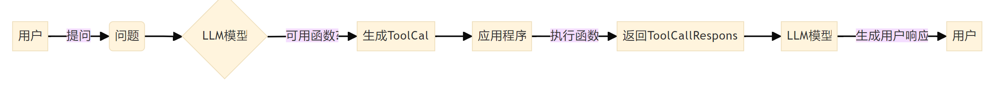
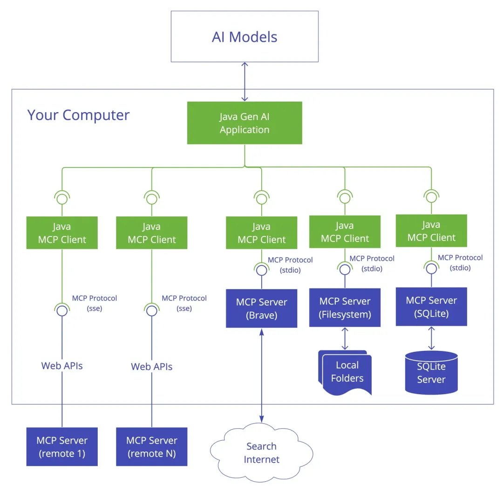

# 模型上下文协议 MCP

MCP是一个用于应用标准化为大模型提供上下文的开放协议，用单一协议取代了碎片化的集成方式。能以更简单、更可靠的方式让人工智能系统获取所需数据，就像 USB-C 一样可以实现给设备连接各种外设和配件。

官方文档：https://modelcontextprotocol.io/introduction

MCP Server 一些开源实现：[awesome-mcp-servers](https://github.com/punkpeye/awesome-mcp-servers)、[Open-Source MCP servers](https://glama.ai/mcp/servers)

目前提供了四种语言的SDK:

+ Python
+ TS
+ Java
+ Kotlin

## 基础内容

### 相关规范

MCP 通信规范：[Specification (Latest)](https://spec.modelcontextprotocol.io/specification/2024-11-05/)

MCP 请求编码规范：[JSON-RPC 2.0](https://wiki.geekdream.com/Specification/json-rpc_2.0.html)

JSON Schema 规范：https://json-schema.apifox.cn/

> JSON Schema 是用于描述以及验证 JSON 数据结构的规则。MCP 中通过 JSON-RPC 传递 JSON 格式请求数据，但是在调用服务端资源时，需要验证 JSON 请求数据是否合法，就是通过 JSON Schema 定义进行校验。

### JSON Schema

Function Calling LLM 生成函数调用JSON时，Spring AI 调用 @Tool 注解的工具方法时都会用到。

[JSON Schema 规范](https://json-schema.apifox.cn/)。

Java 通过 Method 自动生成 Schema 字符串以及验证 JSON 格式可以参考 Spring AI 源码：[spring-ai/spring-ai-core/src/main/java/org/springframework/ai/util/json](https://github.com/spring-projects/spring-ai/tree/main/spring-ai-core/src/main/java/org/springframework/ai/util/json)， 借助下面依赖实现：

```xml
<dependency>
    <groupId>com.fasterxml.jackson.module</groupId>
    <artifactId>jackson-module-jsonSchema</artifactId>
</dependency>
<dependency>
    <groupId>com.github.victools</groupId>
    <artifactId>jsonschema-generator</artifactId>
    <version>${jsonschema.version}</version>
</dependency>

<dependency>
    <groupId>com.github.victools</groupId>
    <artifactId>jsonschema-module-jackson</artifactId>
    <version>${jsonschema.version}</version>
</dependency>
```

JSON Schema 是用于验证 JSON 数据结构的强大工具，Schema可以理解为模式或者规则。

JSON Schema 不应该感到陌生，因为很多 Web API 测试工具中都有这个概念，用于校验用户传参是否合法。

当应用程序说“给我一个人的 JSON 记录”时，准确地知道该记录应该如何组织是很重要的。例如，我们需要知道哪些字段是预期的，以及这些值是如何表示的。这就是 JSON Schema 的用武之地。

比如下面一个 JSON Schema 定义一个人的JSON信息中应该包含哪些内容，比如属性的名称、类型等信息。

```json
{
  "type": "object",
  "properties": {
    "first_name": { "type": "string" },
    "last_name": { "type": "string" },
    "birthday": { "type": "string", "format": "date" },
    "address": {
      "type": "object",
      "properties": {
        "street_address": { "type": "string" },
        "city": { "type": "string" },
        "state": { "type": "string" },
        "country": { "type" : "string" }
      }
    }
  }
}
```

下面是一个合法的 JSON 数据：

```json
{
  "first_name": "George",
  "last_name": "Washington",
  "birthday": "1732-02-22",
  "address": {
    "street_address": "3200 Mount Vernon Memorial Highway",
    "city": "Mount Vernon",
    "state": "Virginia",
    "country": "United States"
  }
}
```

下面是一个不合法的 JSON 数据，无法通过 JSON Schema 的验证：

```json
{
  "name": "George Washington",
  "birthday": "February 22, 1732",
  "address": "Mount Vernon, Virginia, United States"
}
```

MCP Java SDK 加法计算器案例中应该设置的 JSON Schema 字符串：

```json
{
    "$schema": "https://json-schema.org/draft/2020-12/schema",
    "type": "object",
    "properties": {
        "a": {
            "type": "number",
            "format": "double",
        },
        "b": {
            "type": "number",
            "format": "double"
        }
    },
    "required": [
        "a",
        "b"
    ],
    "additionalProperties": false
}
```

### 函数呼叫（Function Calling）

MCP 出现之前已经有了一种给 LLM 调用外部工具的方法，即 Function Calling。

Function Calling 允许我们以 JSON 格式向 LLM 模型描述函数，并使用模型的固有推理能力来决定在生成响应之前是否调用该函数。**模型本身不执行函数，而是生成包含函数名称和执行函数所需的参数的 JSON**，即JSON请求参数。

**Function Calling 工作流程图**：



关于 Function Calling 的 Demo 可以参考：[白话理解 ChatGPT API 的函式呼叫功能 (function calling)](https://www.explainthis.io/zh-hans/ai/function-calling)

有个问题：每次请求都需要将所有的 tools 传递给 LLM 么？能否通过 RAG 动态选择工具？

```js
const response = await openai.chat.completions.create({
  model: "gpt-4o",
  messages: [{ role: "user", content: "现在在台北的天气如何？" }],
  tools,	//所有工具的json描述文档，是一个json array，包括函数名、函数参数的 JSON Schema等信息
});
```

## 工作架构



Java Gen AI Application: 是用户核心生成式AI业务应用（MCP 官方称为 MCP Host）；一方面对接 AI 模型，一方面通过 MCP 客户端对接各种 MCP 服务器；MCP服务器是通过MCP协议公开的特定功能的轻量程序（可以是Web服务、文件系统、数据库、网络浏览器等等），就像是电脑的各种外联设备，可以灵活地为应用拓展能力，MCP服务器可以是内部构建的也可以是远程的、第三方的。

> Brave 是一个号称比Google Chrome 快3倍的浏览器。

开发分为**MCP服务器开发**（实现轻量程序，并通过MCP开放）和**MCP客户端开发**（通过MCP实现功能集成）。

### MCP Server 场景

awesome-mcp-servers 上列举了这些场景：

- 📂 - [Browser Automation](https://github.com/punkpeye/awesome-mcp-servers/tree/main?tab=readme-ov-file#browser-automation)

  浏览器自动化；支持搜索、抓取和处理ai友好格式的web内容。比如：网页内容抓取和交互，基于 Google 搜索结果的免费网络搜索。

- 🎨 - [Art & Culture](https://github.com/punkpeye/awesome-mcp-servers/tree/main?tab=readme-ov-file#art-and-culture)

  艺术和文化；访问并探索艺术收藏、文化遗产和博物馆数据库。使 AI 模型能够搜索和分析艺术和文化内容。比如： 从您的视频丛林收藏中添加、分析、搜索和生成视频编辑；集成博物馆API用于艺术拼搜索、详情和收藏；整合 AniList API 的动漫和漫画信息。

- ☁️ - [Cloud Platforms](https://github.com/punkpeye/awesome-mcp-servers/tree/main?tab=readme-ov-file#cloud-platforms)

  云平台服务集成。比如：通过 MCP 进行 Kubernetes 集群操作、管理、应用健康分析等。

- 🖥️ - [Command Line](https://github.com/punkpeye/awesome-mcp-servers/tree/main?tab=readme-ov-file#command-line)

  运行命令，捕获输出，比如：使用 `run_command` 和 `run_script` 工具运行任何命令。

- 💬 - [Communication](https://github.com/punkpeye/awesome-mcp-servers/tree/main?tab=readme-ov-file#communication)

  与通信平台集成以实现消息管理和频道操作。比如：集成企业邮箱、企业微信机器人、Bluesky去中心化社交网络。

- 👤 - [Customer Data Platforms](https://github.com/punkpeye/awesome-mcp-servers/tree/main?tab=readme-ov-file#customer-data-platforms)

  提供访问客户数据平台内的客户档案。比如：访问和更新 Apache Unomi CDP 服务器上配置文件，与 iaptic 连接，了解客户购买、交易数据和执行应用程序收入统计。

- 🗄️ - [Databases](https://github.com/punkpeye/awesome-mcp-servers/tree/main?tab=readme-ov-file#databases)

  比如：实现与 Elasticsearch、Tablestore、ClickHouse、MySQL、PostgreSQL、SQLite、MongoDB、Kafka 等等交互。

- 🛠️ - [Developer Tools](https://github.com/punkpeye/awesome-mcp-servers/tree/main?tab=readme-ov-file#developer-tools)

  工具集成，增强开发工作流程和环境管理。比如：进行 Docker 容器管理和操作，使用 Open API 规范（v3）连接任何 HTTP/REST API 服务器，帮助LLMs在编写代码时建议最新的稳定包版本，与 Postman API 交互，无缝文档格式转换支持 Markdown、HTML、PDF、DOCX (.docx)、csv 等，提供 SQL 分析代码检查和方言转换，通过断点和表达式评估实现（语言无关）的自动调试，使用 AI 控制 Android 设备实现设备控制、调试、系统分析和 UI 自动化，生成美观交互式思维导图，实现 Claude Code 功能使 AI 能够理解、修改和项目分析并提供全面工具支持。

- 📂 - [File Systems](https://github.com/punkpeye/awesome-mcp-servers/tree/main?tab=readme-ov-file#file-systems)

  提供对本地文件系统的直接访问，具有可配置的权限。使 AI 模型能够在指定的目录中读取、写入和管理文件。

- 💰 - [Finance & Fintech](https://github.com/punkpeye/awesome-mcp-servers/tree/main?tab=readme-ov-file#finance--fintech)

  集成金融数据、加密货币市场 API 或工具，实现查询实时市场数据、加密货币价格和金融分析。

- 🎮 - [Gaming](https://github.com/punkpeye/awesome-mcp-servers/tree/main?tab=readme-ov-file#gaming)

  集成游戏相关数据、游戏引擎和服务。

- 🧠 - [Knowledge & Memory](https://github.com/punkpeye/awesome-mcp-servers/tree/main?tab=readme-ov-file#knowledge--memory)

  使用知识图谱结构进行持久化内存存储。使 AI 模型能够在会话间维护和查询结构化信息。

- 🗺️ - [Location Services](https://github.com/punkpeye/awesome-mcp-servers/tree/main?tab=readme-ov-file#location-services)

  地理位置和基于位置的服务集成。

- 🎯 - [Marketing](https://github.com/punkpeye/awesome-mcp-servers/tree/main?tab=readme-ov-file#marketing)

  创建和编辑营销内容、处理网页元数据、产品定位和编辑指南的工具。

- 📊 - [Monitoring](https://github.com/punkpeye/awesome-mcp-servers/tree/main?tab=readme-ov-file#monitoring)

  访问并分析应用程序监控数据。**使 AI 模型能够审查错误报告和性能指标**， 比如：在 Grafana 实例中搜索仪表板、调查事件和查询数据源，允许LLMs通过 MCP 兼容接口检索实时系统信息。

- 🔎 - [Search](https://github.com/punkpeye/awesome-mcp-servers/tree/main?tab=readme-ov-file#search)

  比如：集成 Brave、Kagi、Tavily 等的搜索 API 实现网络搜索功能，深度搜索。

- 🔒 - [Security](https://github.com/punkpeye/awesome-mcp-servers/tree/main?tab=readme-ov-file#security)

  比如：集成 dnstwist 检测错别字劫持、钓鱼和公司间谍活动。

- 🚆 - [Travel & Transportation](https://github.com/punkpeye/awesome-mcp-servers/tree/main?tab=readme-ov-file#travel-and-transportation)

  集成相关平台的API，实现旅行和交通信息访问。

- 🔄 - [Version Control](https://github.com/punkpeye/awesome-mcp-servers/tree/main?tab=readme-ov-file#version-control)

  与 Git 仓库和版本控制平台交互

- 🛠️ - [Other Tools and Integrations](https://github.com/punkpeye/awesome-mcp-servers/tree/main?tab=readme-ov-file#other-tools-and-integrations)

### MCP Server 框架

MCP 只是一个协议，为了支持 MCP Server 快速开发，除了官方SDK，还有一些开源的 MCP Server 框架，就好比 RPC 是一个协议，有 Grpc、Thrift、Dubbo 等 RPC 框架，参考：[MCP Server Frameworks](https://github.com/punkpeye/awesome-mcp-servers/tree/main?tab=readme-ov-file#frameworks)。另外还有一些工具：[MCP Server Utilities](https://github.com/punkpeye/awesome-mcp-servers/tree/main?tab=readme-ov-file#utilities)

+ Golang
  + [Foxy Contexts](https://github.com/strowk/foxy-contexts)
  + [mark3labs/mcp-go](https://github.com/mark3labs/mcp-go)
  + [metoro-io/mcp-golang](https://github.com/metoro-io/mcp-golang) 

+ Rust
  + [mcp-rs-template](https://github.com/linux-china/mcp-rs-template)

+ Java 
  + [spring-projects-experimental/spring-ai-mcp](https://github.com/spring-projects-experimental/spring-ai-mcp)
  + [quarkiverse/quarkus-mcp-server](https://github.com/quarkiverse/quarkus-mcp-server)

### MCP 客户端与服务器交互

>  注意官方文档内容很简略仅仅是大概做了个功能描述，至于编程实现自己的 MCP 服务端和客户端建议去看SDK源码。

以 Java MCP 为例，其MCP通信原理遵循三层架构：


+ **Client/Server Layer**: 两者都使用 McpSession 进行通信管理
+ **Session Layer**: 通过 DefaultMcpSession 实现管理通信模式和状态，Session 本质就是带着一些连接相关信息的连接。
+ **Transport Layer**: 处理 JSON-RPC 消息的序列化和反序列化，支持多种传输实现。

MCP服务器可以提供三种主要类型的功能：

+ **资源**：可由客户端读取的类文件数据（如API响应或文件内容）
+ **工具**：可由LLM调用的函数（经用户批准）
+ **提示**：帮助用户完成特定任务的预编写模板

> 它们在 SDK 中被定义为了接口规范，比如 Java SDK中：SyncResourceSpecification、AsyncResourceSpecification、SyncToolSpecification、AsyncToolSpecification、SyncPromptSpecification、AsyncPromptSpecification。

MCP 客户端和服务器之间支持通过两种协议交互，均使用[JSON-RPC](https://www.jsonrpc.org/) 2.0 交换消息 ：

+ **Stdio**

  使用**标准输入/输出**进行通信，适用于本地进程间通信。

+ **HTTP with SSE**

  客户端到服务器使用 **HTTP POST**, 服务器到客户端使用 **SSE**，适用于远程通信。

消息类型分为：

+ **Requests** （请求）
+ **Results**（成功响应）
+ **Errors**（错误响应）
+ **Notifications**（单向的通知）

连接生命周期：

1. 连接初始化
   1. 客户端发送带有协议版本和功能的 `initialize` 请求
   2. 服务器响应其协议版本和功能
   3. 客户端发送 initialized 通知作为确认
   4. 正常消息交换开始
2. 消息交换
3. 连接终止

#### 工具 Stdio 通信

以官方案例  [weather service](https://modelcontextprotocol.io/quickstart/server) 为例，分析 MCP 客户端与服务器的开发、部署、交互、测试模板，完整源码位于 [spring-ai-examples/model-context-protocol/weather](https://github.com/spring-projects/spring-ai-examples/tree/main/model-context-protocol/weather)，MCP 客户端位于测试目录中，此 Demo 展示的是 MCP Server **工具**的实现。

### AI 应用 、LLM 与 MCP 对接

**Cherry Studio 集成 MCP 调用外部资源的处理流程是借助 function calling 实现的**，所以处理流程和 function calling 一样。

**原理**：向 AI 模型发送消息（请求），如果启用 MCP Tool，应用需要在消息中会附带 Tool 信息（会转换为模型 API Function Calling Tool 格式），当 AI 模型识别出自己需要调用 MCP Tool 会返回调用 MCP Tool 需要的参数信息，然后当前请求结束；AI 应用获取到模型返回的参数信息，使用 MCP 客户端向 MCP Server 发送调用请求，获取调用结果后将结果数据追加到之前的消息中，再次向 AI 模型发送消息，AI 模型会根据 MCP Tool 调用结果进行响应。

详细参考 [MCP-Cherry-Studio.md](MCP-Cherry-Studio.md)

### 本地镜像编译

## MCP Server 管理

[MCPHub Desktop](https://www.mcphub.net/): MCP Server 管理工具，MCPHub 类似于 DockerHub、Ollama 等管理工具。支持一键安装/卸载 MCP Server。

## 参考文档

+ https://modelcontextprotocol.io/introduction
+ [从零开始教你打造一个MCP客户端](https://mp.weixin.qq.com/s/zYgQEpdUC5C6WSpMXY8cxw)
+ [深入探讨Function Calling：实现外部函数调用的工作原理](https://www.cnblogs.com/ruipeng/p/18216610)