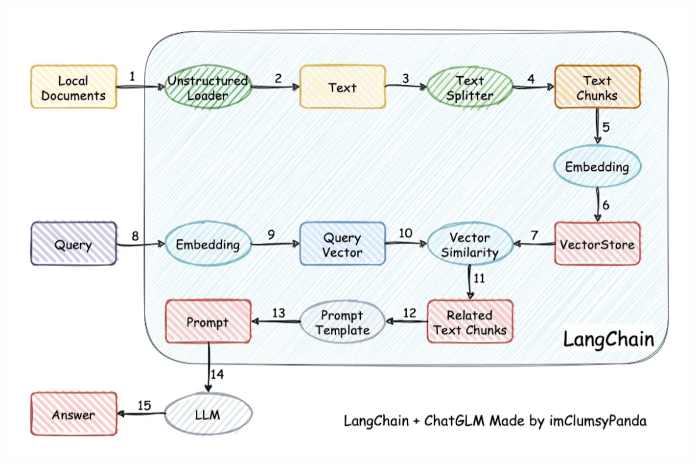

# AI RAG 知识库构建

AI 现在在企业中有一些常见的使用场景：智能客服、文档处理（提炼关键信息）、专业问答、代码生成等等。直接使用 AI 大模型官方的客户端本身也有知识库的概念，但是面向众多用户的情况下，无法支持上传和存储很多客户资料。为此企业需要借助 RAG 技术实现。

RAG (Retrieval-Augmented Generation) 意为检索增强生成，即提供检索能力可以增强内容生成能力。核心是提供海量数据存储，快速索引提取相关信息，并合上下文生成精准、连贯的答案。

RAG 会接受输入并检索出一组相关/支撑的文档，并给出文档的来源（例如维基百科）。这些文档作为上下文和输入的原始提示词组合，送给文本生成器得到最终的输出。RAG 让语言模型不用重新训练就能够获取最新的信息，基于检索生成产生可靠的输出。

开源项目（可以深入理解内部实现）：

+ [Langchain-Chatchat](https://github.com/chatchat-space/Langchain-Chatchat)

  基于 Langchain 与 ChatGLM, Qwen 与 Llama 等语言模型实现的 RAG 与 Agent 应用，开发语言：TS、Python。

##  RAG 知识库工作流程和架构

比如 LangChain RAG 的流程：



本质是**先从知识库查找与问题相关的文档集合，然后生成额外的提示词（Prompt）合并到问题提示词中，最后调用大模型接口**。即知识库的作用本质是**提示词增强**。

+ **大模型本地部署**

  首先需要企业自己部署大模型，可以借助 Ollama 部署。

  > 没研究大模型是否可以使用第三方知识库，但是出于敏感数据和安全问题企业一定要私有化部署。
  >
  > + **Ollama**
  >
  >    是一个基于 Go (Gin) 语言开发的简单易用的本地大语言模型运行框架，可以将其类比为 docker，可以在本地环境中**快速部署**和**使用 AI 模型**。
  >
  >   **Ollama 功能**：
  >
  >   + **管理模型**
  >
  >     像 Docker 一样管理。
  >
  >     官方模型仓库，https://ollama.com/library。
  >
  >   + **API 接口**（兼容 OpenAI 接口）
  >
  >     提供了像 OpenAI 一样的接口，现在已经兼容了 OpenAI 接口交互标准，参考 pr：[1331](https://github.com/ollama/ollama/pull/1331)，v0.1.24 版本合并。
  >     所以使用 Ollama 部署大模型，不再必须使用官网的 SDK 再开发一个Web大模型服务。
  >
  >     **API 列表**：
  >
  >     参考 Ollama Github 仓库中的文档：[api.md](https://github.com/ollama/ollama/blob/main/docs/api.md)
  >
  >     [Generate a completion](https://github.com/ollama/ollama/blob/main/docs/api.md#generate-a-completion)、[Generate a chat completion](https://github.com/ollama/ollama/blob/main/docs/api.md#generate-a-chat-completion)、[Create a Model](https://github.com/ollama/ollama/blob/main/docs/api.md#create-a-model)、[List Local Models](https://github.com/ollama/ollama/blob/main/docs/api.md#list-local-models)、[Show Model Information](https://github.com/ollama/ollama/blob/main/docs/api.md#show-model-information)、[Copy a Model](https://github.com/ollama/ollama/blob/main/docs/api.md#copy-a-model)、[Delete a Model](https://github.com/ollama/ollama/blob/main/docs/api.md#delete-a-model)、[Pull a Model](https://github.com/ollama/ollama/blob/main/docs/api.md#pull-a-model)、[Push a Model](https://github.com/ollama/ollama/blob/main/docs/api.md#push-a-model)、[Generate Embeddings](https://github.com/ollama/ollama/blob/main/docs/api.md#generate-embeddings)、[List Running Models](https://github.com/ollama/ollama/blob/main/docs/api.md#list-running-models)、[Version](https://github.com/ollama/ollama/blob/main/docs/api.md#version)、
  >
  > + **[one-api](https://github.com/songquanpeng/one-api)**：
  >
  >   LLM API 管理 & 分发系统, 通过标准的 OpenAI API 格式访问所有的大模型。
  >
  > + **[Spring AI](https://docs.spring.io/spring-ai/reference/)**：
  >
  >   Spring AI 项目旨在简化开发集成人工智能功能的应用程序。Spring AI 定位和 LangChain 一样，官方也说是“从著名的 Python 项目如 LangChain 和 LlamaIndex 中汲取灵感”。
  >
  >   开源仓库：https://github.com/spring-projects/spring-ai
  >
  >   功能：
  >
  >   + 跨人工智能提供商的便携式 API 支持，包括聊天、文本到图像和嵌入模型。同时支持同步和流式 API 选项。也可访问特定模型的特性。
  >   + 支持所有主要 AI 模型提供商，如 Anthropic、OpenAI、Microsoft、Amazon、Google 和 Ollama。
  >   + 结构化输出 - 将 AI 模型输出映射到 POJOs。
  >   + 支持所有主流向量数据库提供商，如 Apache Cassandra、Azure Cosmos DB、Azure Vector Search、Chroma、Elasticsearch、GemFire、MariaDB、Milvus、MongoDB Atlas、Neo4j、OpenSearch、Oracle、PostgreSQL/PGVector、PineCone、Qdrant、Redis、SAP Hana、Typesense 和 Weaviate。
  >   + 跨向量存储提供商的便携式 API，包括一种新颖的类似 SQL 的元数据过滤 API。
  >   + 工具/函数调用 - 允许模型请求执行客户端工具和函数，从而根据需要访问必要的实时信息并采取行动。
  >   + 文档摄入 ETL 框架，数据工程。
  >   + 人工智能模型评估 - 帮助评估生成内容并防止幻觉响应的工具。
  >   + Spring Boot 自动配置和 AI 模型及向量存储启动器。
  >   + ChatClient API - 用于与 AI 聊天模型通信的流畅 API，与 WebClient 和 RestClient API 在语法上相似。
  >   + 顾问 API - 封装重复出现的生成式 AI 模式，转换发送到和从语言模型（LLMs）的数据，并提供跨各种模型和用例的可移植性。
  >   + 支持聊天会话记忆和检索增强生成（RAG）。

+ **数据准备和知识库构建** (RAG知识库后端开发主要做这部分内容)

  + **数据上传**

    可以是各种文字，比如文档内容、源码文件内容等；可以来源于文档、网页、数据库等。

  + **数据清洗**

    主要去除无用、重复信息等。

  + **知识库构建**

    将清洗后的数据分割成小的片段（chunks），通过文本嵌入模型（如 GLM）将片段转换成向量，存储到向量数据库中。


  > + **Spring AI 的实现** 
  >
  >   Spring AI 中上述流程是通过 [ETL管道](https://docs.spring.io/spring-ai/reference/api/etl-pipeline.html) 实现。ETL 管道 Extract、Transform、Load 阶段分别对应三个组件： DocumentReader、DocumentTransformer、DocumentWriter。
  >
  >   **DocumentReader** 支持 JSON、Text、HTML、Markdown、PDF、DOCX、PPTX、HTML 等文档读取。为了支持更多文件类型的读取，引入了 Apache Tika，其支持的文档类型参考 [Tika documentation](https://tika.apache.org/2.9.0/formats.html)，包括音频、视频、图片、源码文件等等。DocumentReader 读取文件内容并生成**结构化的文本数据**。
  >
  >   Tika Maven 依赖：
  >
  >   ```xml
  >   <dependency>
  >       <groupId>org.springframework.ai</groupId>
  >       <artifactId>spring-ai-tika-document-reader</artifactId>
  >   </dependency>
  >   ```
  >
  >   **DocumentTransformer** 中提供了5种组件：
  >
  >   TextSplitter： 文本分割器；
  >   TokenTextSplitter：分词文本分割器；将解析后的文本内容拆分为更小的片段。拆分策略可以根据需求进行调整，例如按句子、段落或固定长度的 token 进行拆分，然后为每个片段添加标记。标记的作用是区分不同的知识库内容，例如通过标记标识文件的来源、类别或其他元数据信息，以是简单的字符串标签，也可以是结构化的 JSON 数据。
  >   ContentFormatTransformer：内容格式转换器；
  >   KeywordMetadataEnricher  关键词元数据丰富器；
  >   SummaryMetadataEnricher  摘要元数据丰富器。
  >
  >   DocumentWriter 中提供了2中组件：
  >
  >   FileDocumentWriter; 
  >   VectorStore：提供与各种向量存储的集成，支持众多向量数据库；使用 Spring AI 提供的向量模型将标记后的文本片段转换为向量表示，向量化过程将文本内容映射到高维向量空间，便于后续的相似性搜索和检索，最后将向量化后的文本片段及其标记存储到向量库中。每种向量库都有对应的依赖，比如 pgvector:
  >
  >   ```xml
  >   <dependency>
  >       <groupId>org.springframework.ai</groupId>
  >       <artifactId>spring-ai-pgvector-store</artifactId>
  >   </dependency>
  >   <!-- Starter -->
  >   <dependency>
  >   	<groupId>org.springframework.ai</groupId>
  >   	<artifactId>spring-ai-pgvector-store-spring-boot-starter</artifactId>
  >   </dependency>
  >   ```
  >
  > + **常用向量数据库对比**
  >
  >   Spring AI 官方文档列举了一些支持存储向量数据的数据库，[Vector Databases](https://docs.spring.io/spring-ai/reference/api/vectordbs.html)。
  >
  >   DeepSeek 做的对比：
  >
  >   | **特性**     | **Pinecone**         | **Weaviate**            | **Qdrant**           | **Milvus**               | **Vespa**                | **Chroma**               |
  >   | :----------- | :------------------- | :---------------------- | :------------------- | :----------------------- | :----------------------- | :----------------------- |
  >   | **使用场景** | 推荐系统、语义搜索   | 知识图谱、语义搜索      | 语义搜索、推荐系统   | 图像检索、NLP            | 大规模知识库、个性化搜索 | 语义搜索、知识库检索     |
  >   | **功能**     | 全托管、简单 API     | 开源、混合搜索、GraphQL | 开源、高效搜索、过滤 | 开源、多种索引、GPU 加速 | 开源、实时更新、强大排序 | 开源、嵌入存储、简单 API |
  >   | **性能**     | 高性能、低延迟       | 高性能、实时搜索        | 高性能、低延迟       | 高性能、支持 GPU         | 高性能、实时搜索         | 高性能、低延迟           |
  >   | **高可用性** | 高可用、自动故障恢复 | 分布式、高可用          | 分布式、高可用       | 分布式、高可用           | 分布式、高可用           | 分布式、高可用           |
  >   | **扩展性**   | 自动扩缩容           | 水平扩展                | 水平扩展             | 水平扩展                 | 水平扩展                 | 水平扩展                 |
  >   | **适合规模** | 小规模到大规模       | 中等规模到大规模        | 中等规模到大规模     | 超大规模                 | 超大规模                 | 中等规模到大规模         |
  >
  >   DeepSeek 选择建议：
  >
  >   - **需要全托管服务**：选择 **Pinecone**。
  >   - **需要结合结构化数据和向量搜索**：选择 **Weaviate**。
  >   - **需要高效相似性搜索和过滤**：选择 **Qdrant**。
  >   - **需要处理高维向量数据**：选择 **Milvus**。
  >   - **需要实时更新和查询**：选择 **Vespa**。
  >   - **需要快速构建嵌入存储和检索**：选择 **Chroma**。
  >
  > + **向量维度**
  >
  >   文本数据最后是向量化后存储到向量数据库，向量的维度体现数据特征的丰富度，向量本质是一个数组，维度是数组中元素的个数。向量维度取决于向量话模型，比如 nomic-embed-text 文本嵌入模型，默认生成的向量维度是 768。

+ **检索模块**

  + **问题向量化**

    将问题通过相同的 GLM 模型转成向量。

  + **相似度检索**
  + **结果排序**

+ **结果生成模块**

  + **上下文融合**

    将检索到的相关片段与原始问题合并，形成更丰富的问题上下文信息。

  + **大语言模型生成**

    使用大语言模型（如GLM）基于上述上下文信息生成回答。大语言模型会学习如何根据检索到的信息来生成准确、有用的回答。

## RAG 组件部署

+ 核心组件：

  + 大模型（Ollama 本地部署）

    ```shell
    # 这里用 Docker 部署的 Ollama 先进入容器控制台
    docker exec  -it rag-ollama /bin/bash
    # 这里拉取 deepseek-r1 最轻量的模型 1.5b，15亿参数规模，1.1G，注意容器重建后会丢失需要重新拉取
    ollama pull deepseek-r1:1.5b
    # 向量文本，Nomic Embed Text 是一个用于生成高质量文本嵌入（Text Embeddings）的工具或模型。文本嵌入是将文本（如单词、句子或文档）转换为固定长度的向量表示的过程，这些向量能够捕捉文本的语义信息，并用于各种自然语言处理（NLP）任务
    # 用于在用户的问题上嵌入知识库中相关内容的向量用于检索
    ollama pull nomic-embed-text
    # 启动并测试
    ollama run deepseek-r1:1.5b
    >>> 1 + 1 = ?
    ```

  + 向量库

    用于存储文档经过解析后生成的向量数据。

  > 部署脚本参考 kwseeker/ai-rag 仓库。

+ 其他

  根据业务需要部署。

## 参考资料

+ [带你认识本地大语言模型框架Ollama](https://wiki.eryajf.net/pages/97047e/)
