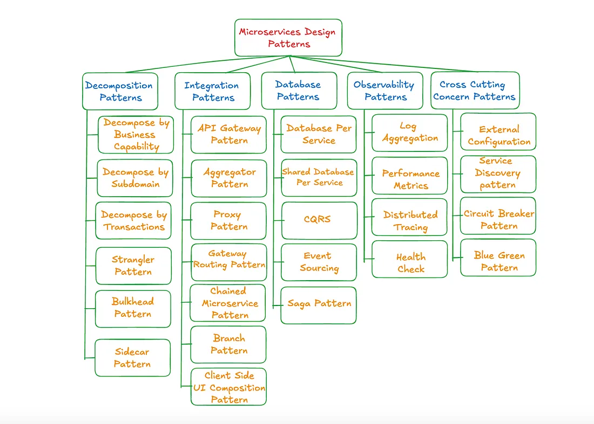

# 26 种微服务设计模式

> 注意不是软件工程的26种设计模式！
>
> 刚开始是从B站看到有UP分享这部分内容：[微服务架构5类26种设计模式概述](https://www.bilibili.com/video/BV1pW52zWEh8?spm_id_from=333.788.videopod.sections&vd_source=e085f6b3e74d1e9c35fe18734cac42f7), 但是UP没有说明从哪里看到的，Google 搜索 “Microservices Design Patterns” 最终找到这么两篇文章：[An In-Depth Guide to Microservices Design Patterns](https://www.openlegacy.com/blog/microservices-architecture-patterns/) 、[Mastering Microservices : An In-Depth Guide to Architecture Design Patterns](https://medium.com/@sudhindra_saxena/mastering-microservices-an-in-depth-guide-to-architecture-design-patterns-89315ab3bae7) (注意需要科学上网)，其中包含十种最核心的微服务设计模式：[Microservices Design Patterns](https://www.geeksforgeeks.org/microservices-design-patterns/)。
>
> 像一些云服务提供商官方文档也有提到过**微服务设计模式**（也有称**微服务架构模式**）的概念：
>
> + [Design patterns for microservices](https://learn.microsoft.com/en-us/azure/architecture/microservices/design/patterns) (Azure)
>
> 甚至有一本书：
>
> + 《微服务架构设计模式》克里斯-理查森（Chris Richardson）著
>
> 微服务设计模式只有这26种么？
>
> 其实没有定论，比如 Azure 列举的云服务设计模式：[Cloud design patterns](https://learn.microsoft.com/en-us/azure/architecture/patterns/)。

## 微服务架构设计原则 （8）

+ 自主性（Autonomy）

  每个服务独立运行，消除了依赖性引起的问题。这也允许更大的部署灵活性。

  > 个人理解并不是系统中所有服务都必须独立运行，像一些上层服务还是需要依赖基础服务，基础设施。应该说的是同级的服务应该遵循自主性。

+ **可伸缩性**（Scalability）

  服务可以根据需求即时扩展或缩减，优化资源分配和成本。

+ **弹性**（Resilience）

  如果一个服务崩溃，不会影响其他服务。软件也可以更快地从故障中恢复。

+ 去中心化（Decentralization）

  开发团队可以独立工作，加快上市时间并提高生产力。

+ **负载均衡**（Load balancing）

  架构可以将进入流量均匀地分配到服务器上。这可以防止过载并提高性能。

+ **DevOps 集成**（DevOps integration）

  即CICD，通过将 DevOps 集成到微服务架构中，您可以确保快速交付高质量的服务。

+ **持续监控**（Continuous monitoring）

  实时监控工具确保最高水平的性能、安全和可用性。

+ **容错性**（Fault tolerance）

  即使一个或多个服务失败，系统仍然继续运行，确保用户体验的一致性。

  > 容错性和弹性的区别：
  >
  > 容错性是**容忍故障的发生**，强调通过冗余设计（多副本、集群）、超时与重试、优雅降级、故障隔离等手段处理故障；
  >
  > 弹性强调**从故障中恢复的能力**，比如服务因高负载崩溃后，通过自动扩容（Auto-scaling）恢复；断路器（Circuit Breaker）在检测到故障后暂时熔断，稍后自动重试恢复。

## 微服务设计模式

> 其实里面大部分模式我们不会感到陌生，即使没写过、也用过、即使没用过也听说过。

+ **分解模式**（Decomposition Patterns）

  微服务分解是将应用程序分解成更小的独立服务的过程。

  > 但是实际做服务拆分遵照的原则主要有四点：可用性、复用性、康威定律、异构系统。

  + **按业务能力分解** （Decompose by Business capability）

    其实就是按单一职责分解服务。

  + **按子域分解** （Decompose by Subdomain）

    指按 DDD 的子域和边界上下文分解服务。

  + **按事务分解**（Decompose by Transactions）

    在这种模式中，每个事务及其支持组件属于单个微服务。解决了在事务跨越多个服务时出现的问题，如延迟增加和复杂性。

    > 个人理解是在拆分服务时尽量避免出现分布式事务，即不要将一个事务流程拆分到多个微服务中。

  + **绞杀者模式**（Strangler Pattern）

    这种模式允许您在不中断用户体验的情况下，逐步将数据和功能从单体迁移到新的微服务。在迁移期间，开发者应确保两个系统都可以访问相关资源。

    具体实现：

    将旧的单体系统的功能一个个地开发到新的微服务系统中，每个功能开发测试完毕后，就将相关的流量从旧的单体系统重新路由到新的微服务系统，在所有功能迁移完毕前，两个系统会一直共存直到迁移完成。

  + **舱壁模式** （Bulkhead Pattern）

    通过将服务实例隔离到不同的部分（分组）来实现。如果一个部分失败，其他部分不受影响可以继续运行。

    具体实现：

    比如：Tomcat 每个 war 包运行在自己专属的 Web 容器进程，或者多机房部署，这些应该都是舱壁模式的实现。

  + **边车模式**（Sidecar Pattern）

    为主服务配置一个”边车容器”，在这个容器中设置辅助功能，比如日志和监控，边车容器提供了隔离和封装，与主服务有相同的生命周期。

    具体实现：

    比如边车模式实现日志上报，如果让我来实现，可能会借助线程池和生产者消费者模式实现。

+ **集成模式**（Integration Patterns）

  + **API网关模式**（API Gateway Pattern）

    定义网关服务作为微服务系统门户，负责请求转发、结果汇总、协议转换、认证鉴权等。

  + **聚合器模式** （Aggregator Pattern）

    做服务聚合实现一个聚合服务，比如一个交易服务可能依赖多个微服务，比如订单、支付、积分等。这样后面执行某个交易只需要调用交易服务的接口。

  + **代理模式**（Proxy Pattern / Backend for frontend ）

    针对不同的前端专门配置的后端代理服务，比如下面针对桌面端和手机端分别设置了一个 BFF 服务，用于不同客户端差异性处理（比如适配、转化）。

    

  + **网关路由模式**（Gateway Routing Pattern）

    根据请求路径将请求转发给对应的微服务实例。

  + **链式微服务模式**（Chained Microservice Pattern）

    业务需要按顺序调用微服务，前一个服务的结果作为后一个服务的输入，处理需要串联多个步骤的业务。

    应该是通过编码实现。

  + **分支模式**（Branch Pattern）

    同时调用多个服务（并行或链式），合并结果后返回，适合需要同时获取多源数据的场景。

  + **客户端 UI 组合模式**（Client-Side UI Composition Pattern）

    UI 页面拆分为多个区域，每个区域调用独立微服务获取数据，用 React 等框架组合成完整页面。

+ **数据库模式**（Database Patterns）

  + **服务私有数据库模式**（Database Per Service）

    强调应该为每个服务单独设置一个独占的数据库，其他服务不能直接访问，保证数据的隔离和独立部署。

  + **服务共享数据库模式**（Shared Database Per Service）

    多个服务共用一个数据库，适合从单体应用迁移的过渡阶段，长期看是反模式。

  + **命令查询职责分离**（CQRS: Command Query Responsibility Segregation）

    将数据操作拆成写操作（命令）和读操作（查询），读操作通过实时更新的视图快速查询。

    就是读写分离，比如写数据时写到 MySQL 并同步到 ES , 读时从 ES 查询。

    详细参考：[CQRS pattern](https://learn.microsoft.com/en-us/azure/architecture/patterns/cqrs)。

  + **事件溯源模式**（Event Sourcing Pattern）

    主张记录所有数据变更事件，比如商品从创建订单到支付流程，记录订单状态变化、用户扣款数量等等，用于追踪历史、数据恢复、问题定位等。

  + **Saga 模式**（Saga Pattern）

+ **可观测性模式**（Observability Patterns）

  + **日志聚合**（Log Aggregation）

    把各个服务的日志集中到一个地方，方便搜索、分析、设置告警等，比如使用 ELK 聚合各个微服务的日志。

  + **性能指标**（Performance Metrics）

    即收集各个服务的性能数据（调用次数、响应时间、CPU 内存占用等），并配置监控。

  + **分布式追踪**（Distributed Tracing）

    给每个请求分配唯一 ID, 跟着请求在各个服务间传递，用于排查跨服务调用故障。

  + **健康检查**

    为每个服务实例都设置一个健康状态接口（如：/health），用于检测服务是否正常。

+ **跨领域关注模式**（Cross Cutting Concern Patterns）

  + **外部配置**（External Configuration）

    主张将服务的配置放在外部，启动时动态加载，修改时不用重启服务。比如将服务配置放在 Nacos。

  + **服务发现模式**（Service Discovery Pattern）

    主张服务实例启动时将服务实例IP等信息注册到注册中心，服务调用者通过注册中心查找服务实例地址列表。

  + **断路器模式**（Circuit Breaker Pattern）

    主张为服务配置断路器，当调用下游服务失败次数太多或超时就直接拒绝访问。

  + **蓝绿部署模式**（Blue-Green Deployment Pattern）

    主张生产环境应该部署两套系统，一个运行旧版本，一个运行新版本，为了方便新版本出现问题时能够快速回滚。

