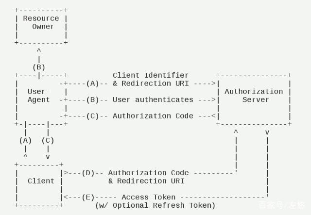
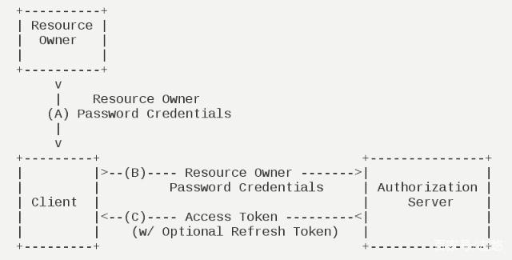
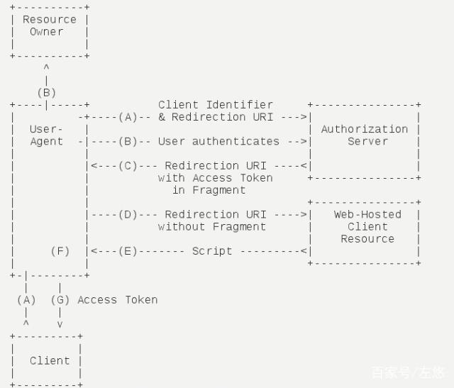
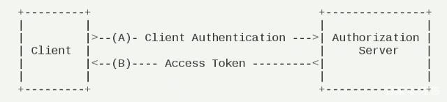
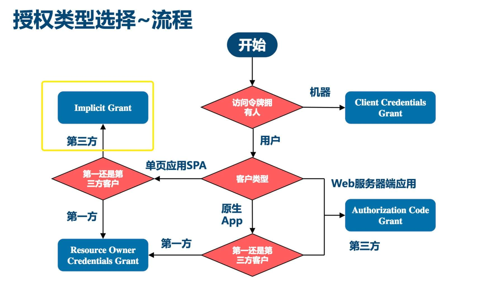

# OAuth2

OAuth2是一个开放授权标准，它允许软件应用代表资源拥有者去访问资源拥有者的资源。应用向资源拥有者请求授权，然后取得令牌(Token)，并用它来访问资源。

OAuth2常用于**第三方授权登录**，应用可以通过OAuth2访问第三方的用户数据，第三方比如QQ、微信、Google、Facebook等等。

但是不仅仅可以用于第三方授权登录，也可以用于**单纯的资源授权访问**、以及**实现单点登录SSO**。

OAuth2没有强制规定接口URL，但是约定了请求和响应的参数。

OAuth2标准详情参考官方文档：https://oauth.net/2/。

>  这里演示OAuth2标准通信流程，会自建一个OAuth2服务端（资源服务和授权服务一体）; 
>
>  如果使用第三方用户数据，需要参考第三方OAuth2服务官方文档，只需要实现客户端对接。


## OAuth2认证授权流程

### OAuth2 组件

+ 资源拥有者（即用户）
+ 客户端应用（比如使用第三方授权的应用）
+ 授权服务器（进行授权的服务器，比如使用微信号登录小程序时小程序平台执行认证服务的服务器）
+ 资源服务器（托管资源的服务器，比如使用微信号登录小程序时托管微信帐号的腾讯的服务器，不局限于帐号数据）

> 授权服务器和资源服务器可以是同一个服务器，OAuth 2.0没有讨论这个两个服务器应该如何通信，自行实现。

### OAuth2中概念

+ 访问令牌

+ 刷新令牌

+ OAuth范围（scope）

+ 客户端类型

+ 授权码

  通过用户名密码等方式认证成功后的返回的凭据，用于给客户端应用换取 AccessToken。

+ 授权码模式请求参数

  授权码模式授权请求可能包含多次重定向，这里列举的是所有请求的参数，其实文档和一些实现中参数有一些差异。

  + grant_type

    授权方式。

  + code

    授权码。

  + response_type

    返回类型，即授权模式，code表示授权码。

  + client_id

    客户端应用ID，客户端应用可能是WEB应用、原生应用，OAuth2是对客户端应用授权的需要知道对哪个应用授权。

  + redirect_uri

    重定向地址，

    用户发出OAuth2授权请求后可能涉及多次重定向请求（如：重定向到授权服务器的登录页面 ---(用户输入用户名密码)---> 授权服务器用户名密码认证 ---(认证成功)---> 重定向到生成授权码），最后生成的授权码需要通过重定向地址返回给页面。

  + scope

    授权范围。

  + state

    用于给客户端检查返回值是否是当前请求的。

  > 可以参考spring security oauth2 中参数的完整定义，位于org.springframework.security.oauth2.common.util.OAuth2Utils。
  >
  > 另外每种授权模式请求参数略有不同。
  >
  > ```java
  > 	/**
  > 	 * Constant to use while parsing and formatting parameter maps for OAuth2 requests
  > 	 */
  > 	public static final String CLIENT_ID = "client_id";
  > 	public static final String STATE = "state";
  > 	public static final String SCOPE = "scope";
  > 	public static final String REDIRECT_URI = "redirect_uri";
  > 	public static final String RESPONSE_TYPE = "response_type";
  > 	public static final String USER_OAUTH_APPROVAL = "user_oauth_approval";
  > 	public static final String GRANT_TYPE = "grant_type";
  > 	/**
  > 	 * Constant to use as a prefix for scope approval
  > 	 */
  > 	public static final String SCOPE_PREFIX = "scope.";
  > ```

  授权请求比如：

  ```
  http://localhost:9001/authorize?
  response_type=code&
  scope=foo&
  client_id=oauth-client-1&
  redirect_uri=http%3A%2F%2Flocalhost%3A9000%2Fcallback&
  state=Lwt50DDQKUB8U7jtfLQCVGDL9cnmwHH1
  ```

  最后返回授权码（重定向到redirect_uri）

  ```
  http://localhost:9000/callback?
  code=8V1pr0rJ&
  state=Lwt50DDQKUB8U7jtfLQCVGDL9cnmwHH1
  ```

+ 授权码模式响应参数

  + access_token

  + token_type

    令牌的类型，通常只是字符串Bearer。

  + expires_in

    令牌在多少秒内过期。

  + refresh_token

    可选，刷新令牌。

  + scope

    可选，授权范围。

+ ...


### OAuth2 工作流程

提供了4种授权模式：

+ 授权码模式（authorization code）
+ 密码模式（resource owner password credentials）
+ 隐藏模式（implicit）
+ 客户端凭证模式（client credentials）

>  官方文档其实展示了7种：
>
> - [Authorization Code](https://oauth.net/2/grant-types/authorization-code/)
> - [PKCE](https://oauth.net/2/pkce/)
> - [Client Credentials](https://oauth.net/2/grant-types/client-credentials/)
> - [Device Code](https://oauth.net/2/grant-types/device-code/)
> - [Refresh Token](https://oauth.net/2/grant-types/refresh-token/)
> - Legacy: [Implicit Flow](https://oauth.net/2/grant-types/implicit/)
> - Legacy: [Password Grant](https://oauth.net/2/grant-types/password/)

#### 授权码模式（authorization code）



**工作流程**：

以新浪微博使用QQ用户名密码OAuth2登录的流程举例， [QQ OAuth2 接入流程](https://wiki.connect.qq.com/%e5%87%86%e5%a4%87%e5%b7%a5%e4%bd%9c_oauth2-0)。

Resource Owner: 用户
User-Agent : 浏览器
Client: 新浪微博服务（作为OAuth2的客户端）
Authorization Server: QQ帐号认证服务

A）用户使用浏览器打开新浪微博登录页面，用户点击QQ登录图标（选择第三方用户授权），页面请求新浪微博后台执行第三方认证，经过多次重定向，QQ认证服务器返回QQ网页登录页面；

```http
# 1 页面请求新浪微博后台接口（/othersitebind/authorize）要求向QQ发起第三方认证
GET https://passport.weibo.com/othersitebind/authorize?site=qq&
entry=mweibo&
res=wel&
callback=https%3A%2F%2Fm.weibo.cn%2Fsetting%2Fnick
# 	https://m.weibo.cn/setting/nick
# 2 新浪微博后台接口将请求重定向到QQ认证服务器（oauth2.0/authorize）
# 	携带新浪微博的客户端ID等参数
GET https://graph.qq.com/oauth2.0/authorize?client_id=101019034&
response_type=code&
scope=get_info%2Cget_user_info&
redirect_uri=https%3A%2F%2Fpassport.weibo.com%2Fothersitebind%2Fbind%3Fsite%3Dqq%26state%3DCODE-gz-1Rfc2n-2dxAtf-Ng16K9wUgeeCeGd47cf59%26bentry%3Dmweibo%26wl%3D%26callback%3Dhttps%253A%252F%252Fm.weibo.cn%252Fsetting%252Fnick&
display=
# 3 QQ认证服务器收到请求再次重定向到QQ快捷登录页面,后面还包含多次请求，最终展示完整的页面
GET https://graph.qq.com/oauth2.0/show?which=Login&display=pc&client_id=101019034&response_type=code&scope=get_info%2Cget_user_info&redirect_uri=https%3A%2F%2Fpassport.weibo.com%2Fothersitebind%2Fbind%3Fsite%3Dqq%26state%3DCODE-gz-1RfcnQ-2dxAtf-2F2hBbILHDl1U055c1b88%26bentry%3Dmweibo%26wl%3D%26callback%3Dhttps%253A%252F%252Fm.weibo.cn%252Fsetting%252Fnick&display=
```

B）用户输入用户名密码，点击授权登录，前往QQ认证服务器认证用户名密码；

```http
GET https://ssl.ptlogin2.qq.com/login?...
# 中间还经过 check_sig 什么的请求, 这里省略了
# 请求生成授权码
POST https://graph.qq.com/oauth2.0/authorize
```

C）认证成功后返回授权码，但是并没有直接返回到新浪微博页面，而是重定向到微博的重定向地址`https://passport.weibo.com/othersitebind/bind`；授权码通过code参数传给重定向地址；

D）新浪微博后台服务请求QQ认证服务器申请访问Token（携带授权码和重定向地址）；

E）QQ认证服务器校验授权码后返回访问Token和更新Token（用于在访问Token过期后获取新的访问Token）；

F）新浪微博使用访问Token请求QQ资源服务器获取用户信息资源；

G）新浪微博使用QQ用户信息刷新页面，显示用户头像，曾现登录状态。

#### 密码模式（resource owner password credentials）



#### 简化模式（implicit）

也有称隐藏模式。



#### 客户端凭证模式（client credentials）

系统内部对客户端应用本身进行身份认证，而不是针对用户。



#### 模式选择



> 这张图感觉不是很准确，Web服务器端应用，如果各个组件都是可信任的，比如一个公司的不同服务，也可以使用密码模式。

授权码模式(authorization code) AccessToken 保存在后端，密码也没有传给除了认证服务器外其他的服务器，风险最低。除了授权码模式，其他都有使用范围限制。唯一的问题是流程复杂。

对比授权码模式的客户端应用无法获取用户名和密码，而密码模式是直接将用户名密码给到客户端服务器， 让客户端服务器自行使用密码去认证服务器获取AccessToken。 但是这样会把用户名密码泄漏给客户端服务器。
使用密码模式，除非客户端服务器是可以信任的，比如客户端服务器和认证服务器、资源服务器都是同一个公司的服务（这种场景使用OAuth2主要是为了建一个统一的认证中心并复用）。
即密码模式适合企业内部不同服务之间的授权。

隐藏模式省略了授权码，直接在Fragment中返回AccessToken，但是由添加了个脚本解密AccessToken的过程，提升了安全性（虽然浏览器可以拿到包含AccessToken的Fragment，但是没法解密出来， 还要再请求一次获取解密脚本）。
一般简化模式用于没有服务器端的第三方单页面应用， 因为第三方单页面应用没有服务器端无法使用授权码模式。

客户端凭证模式：客户端向授权服务器发送客户端自己的身份信息，并请求AccessToken 确认client信息无误后，将AccessToken发送给client。

安全级别: 授权码最高、客户端模式最低、简化模式和密码模式居中；
简化模式危险在浏览器或APP，密码模式风险在客户端服务器。


## OAuth2实现SSO


## Spring Security OAuth2 整合

旧版实现：[spring-security-oauth2](https://github.com/spring-attic/spring-security-oauth) 最后一个版本是2.5.2.RELEASE，现在项目已经废弃；

现在OAuth2功能迁移到了Spring Security oauth2 模块下，但是没有提供认证服务器的实现，认证服务器则是创建了个项目 [spring-authorization-server](https://github.com/spring-projects/spring-authorization-server) 来维护。

新版的认证服务器不支持JDK8, 还是基于旧版做的测试。

其实看 Spring Security OAuth2 源码可以发现，OAuth2 里面涉及的**HTTP接口、返回值、以及数据表（如果选择JdbcClientDetailsService）等都是写死的无法调整的**（可能与项目的风格显得格格不入，甚至无法业务满足要求），需要注意实际项目有没有什么特殊定制需求，如果有的话最好还是自己按照 OAuth2 的标准自行实现，而不是用 Spring Security OAuth2 的封装。

### 借助 Spring Security OAuth2 实现密码模式认证服务

#### 认证服务器

实现代码参考 `auth-java/auth-oauth2-service/oauth2-password-credentials-service`。

Spring Security OAuth2 实现密码模式的认证服务器可能需要重新定制下面组件：

+ **ClientDetailsService**
+ **UserDetailService**
+ **TokenStore**


## 参考：

+ [OAuth 2.0](https://oauth.net/2/) (协议手册，RFC 6749)

+ 客户端

  + [spring-security/oauth2/oauth2-client](https://github.com/spring-projects/spring-security/tree/main/oauth2/oauth2-client)

    oauth2模块下包含4个子模块：

    + oauth2-client (客户端)
    + oauth2-core
    + oauth2-jose（JWT实现）
    + oauth2-resource-server（资源服务器）

  + [google-auth-library-java](https://github.com/googleapis/google-auth-library-java) (module: oauth2_http)

  + [google-oauth-java-client](https://github.com/googleapis/google-oauth-java-client) (2022-06 停止更新)

+ 《OAuth2实战》
+ [芋道 Spring Security OAuth2 入门](https://www.iocoder.cn/Spring-Security/OAuth2-learning/)
