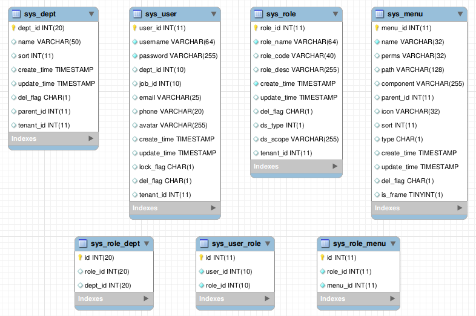
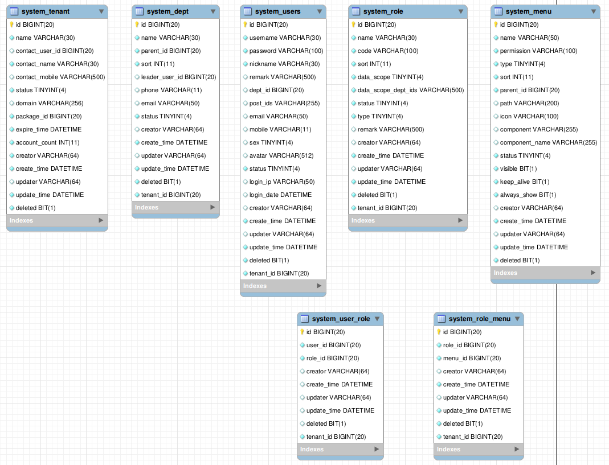

# 基于角色的访问控制

RBAC权限控制系统重点和难点在于怎么设计权限控制的表。

由于后续讲到的一些开源项目用到`Spring Security`、`Shiro`等框架，需要对这些框架工作流程有个简单的了解，可以参考对应的源码分析：[kwseeker/framework-src-guide](https://github.com/kwseeker/framework-src-guide)


## RBAC访问控制流程

1. 一般在认证通过后通过拦截器、过滤器或切面拦截请求（使用Spring Security、Shiro等框架也同样是在这些地方拦截）；
2. 从请求上下文读取用户基本信息（认证通过后请求上下文一般都带着用户基本信息，比如通过Token搜索缓存中的用户信息，或者JWT这种本身带着用户基本信息），查询权限等数据表，获取用户权限信息并保存到请求上下文；
3. 后续的拦截器、过滤器或切面中读取请求的目标路由（Controller）要求的权限信息；
4. 将用户拥有的权限信息与路由要求的权限信息比对，决定是否放行。


## RBAC授权模型

基本的 “**用户-角色-权限**” 授权模型：一个用户可以拥有多个角色，一个角色可以拥有多个权限。

这种一般有5个表（不考虑分库分表），3个实体表，2个关联表；**用户表**、**角色表**、**权限表**、以及关联用户和角色的**用户角色表**，关联角色和权限的**角色权限表**。

通过给角色赋予权限可以方便地实现为所有拥有此角色的用户授权。

如果用户很多，给用户赋予角色本身可能也非常繁琐，然后又出现了 “**用户组-用户-角色-权限**” 授权模型：额外定义 一个用户组可以有多个用户，一个用户组也可以有多个角色；即用户的角色是**自己在用户角色表中的角色** 并上 **自己所属用户组在用户组角色表中的角色**。

这种一般有8个表（不考虑分库分表），4个实体表，4个关联表；其中用户表不仅通过用户角色表和角色表关联，还通过用户组用户表、用户组角色表和角色表关联。

> "用户组-用户-角色-权限" 相对于 “用户-角色-权限” 模型，其实就是增加了一种给用户赋予角色的方法：先给用户赋予一个用户组，再给此用户组赋予角色。
>
> 这样可以方便地实现为一批用户赋予角色。

另外有些权限设计，会把功能操作作为一类，而把文件、菜单、页面元素等作为另一类，这样构成“**用户-角色-权限-资源**”的授权模型：额外定义 一种权限可以执行多种操作，以及一种权限可以访问多种元素。

**拆分比较细的RBAC模型**：

注意里面 OperationLog 表不属于 RBAC 中的一部分，只是记录权限管理操作日志，比较常用。


上面说的仅供参考，并非一定要完全一致。

> 参考文档原文有段话：
>
> “随着系统的日益庞大，为了方便管理，如果有需要可引入角色组对角色进行分类管理，跟用户组不同，角色组不参与授权。
> 例如：当遇到有多个子公司，每个子公司下有多个部门，这是我们就可以把部门理解为角色，子公司理解为角色组，角色组不参于权限分配。另外，为方便上面各主表自身的管理与查找，可采用树型结构，如菜单树、功能树等，当然这些可不需要参于权限分配。”
>
> 对上面的举例不太认同，子公司、多部门，感觉可以将用户组拆分成多级，每一级都可以于角色表关联，更容易理解。

### 一些开源项目的权限管理相关表设计

> github 中搜索 “后台管理系统 RBAC”，直接搜RBAC找到的大部分开源项目质量都不怎么好。

#### [LiHaodong888/pre](https://github.com/LiHaodong888/pre/blob/master/db/pre.sql) 

**此项目RBAC模型**：



可以看到这个项目中**没有定义权限表**，而是直接**将角色绑定到资源**上（借助`sys_role_menu`），或者说**sys_menu就是资源权限表**（这个更恰当），看代码里面用的`Spring Security`框架，`@PreAuthorize`权限认证表达式都是`hasAuthority('<权限标识>')")`，没有用到`hasPermission()`（也没用`hasRole()`），可能没有那么细粒度的权限需求；

`sys_dept`部门表其实是上面说的用户组，通过 `sys_role_dept` 关联到`sys_role`角色表；

`sys_menu`是上面说的资源，里面通过 `perms VARCHAR(32)` （权限标识）指明访问权限，比如`'sys:menu:add'`。

权限标识：

```sql
INSERT INTO `sys_menu` VALUES (28, '菜单增加', 'sys:menu:add', '', '', 16, '', 0, '2', '2019-05-08 16:09:43', '2019-06-08 13:14:02', '0', 1);
INSERT INTO `sys_menu` VALUES (29, '菜单修改', 'sys:menu:update', '', '', 16, '', 0, '2', '2019-05-08 16:10:06', '2019-06-08 13:14:05', '0', 1);
INSERT INTO `sys_menu` VALUES (30, '部门修改', 'sys:dept:update', '', '', 3, '', 0, '2', '2019-05-08 23:49:54', '2019-06-08 13:13:49', '0', 1);
INSERT INTO `sys_menu` VALUES (31, '部门删除', 'sys:dept:delete', '', '', 3, '', 0, '2', '2019-05-08 23:53:41', '2019-06-08 13:13:52', '0', 1);
INSERT INTO `sys_menu` VALUES (33, '用户查看', 'sys:user:view', '', '', 2, '', 0, '2', '2019-05-12 18:59:46', '2019-06-08 11:23:01', '0', 1);
INSERT INTO `sys_menu` VALUES (34, '角色修改', 'sys:role:update', '', '', 13, '', 0, '2', '2019-05-12 19:05:03', '2019-06-08 13:13:29', '0', 1);
```

**此项目权限校验流程**（其他项目也都基本一样，省略框架本身的流程，自动脑补集成到框架后完整的流程）：

1. 登录成功后在 `PreAuthenticationSuccessHandler`（实现`AuthenticationSuccessHandler`接口）中会通过认证信息`Authentication`查询数据表中用户授权信息添加到安全上下文

   ```
   @Select("select m.perms from sys_menu m, sys_user u, sys_user_role ur, sys_role_menu rm\n" +
               "        where u.user_id = #{user_id} and u.user_id = ur.user_id\n" +
               "          and ur.role_id = rm.role_id and rm.menu_id = m.menu_id")
   List<String> findPermsByUserId(Integer userId);
   ```

2. 后续在处理`@PreAuthorize`注解的过滤器中进行授权信息比对。

> AuthenticationSuccessHandler 本质是在认证成功后给Spring Security 过滤器链（FilterChain）中添加了一个过滤器，用于先通过用户ID获取用户的授权信息，然后存储到安全上下文（SeucrityContext）中；

#### [elunez/eladmin](https://github.com/elunez/eladmin/blob/master/sql/eladmin.sql)

和上面的项目的RBAC表基本一样。

#### [yudao-cloud](https://github.com/YunaiV/yudao-cloud/blob/master/sql/mysql/ruoyi-vue-pro.sql)

RBAC模型：



可以看到这个项目中也**没有定义权限表**，也是直接**将角色绑定到资源**上。

此项目权限校验流程：

1. 登录接口中认证成功后，创建令牌Token，插入数据表`system_oauth2_access_token`（但是这里面并没有读取用户权限scopes是空）；

2. 登录成功后后续请求会携带Token在`TokenAuthenticationFilter`（继承`OncePerRequestFilter`）拦截请求执行Token校验（默认实现是通过Token从数据表`system_oauth2_access_token`换取用户基本信息），查找数据不为空且有效期未过期则校验成功；

3. 上一步获取的用户基本信息重新封装成LoginUser对象，然后创建`UsernamePasswordAuthenticationToken`（实现 `Authentication`接口）并加入安全上下文；

4. 后续在处理`@PreAuthorize`注解的拦截器`FilterSecurityInterceptor`中通过自定义的`SecurityFrameworkServiceImpl implements SecurityFrameworkService`以及上一步的`Authentication`从数据表中读取用户所有角色对应的权限（即先查system_role表，再查`system_role_menu`，再查 system_menu）然后进行比对。

   这里查找用户权限和比对的逻辑作者封装到了`yudao-module-system-biz` `package cn.iocoder.yudao.module.system.service.permission`, 通过Feign远程调用。

   ```java
   private final LoadingCache<KeyValue<Long, List<String>>, Boolean> hasAnyPermissionsCache = CacheUtils.buildAsyncReloadingCache(
       Duration.ofMinutes(1L), // 过期时间 1 分钟
       new CacheLoader<KeyValue<Long, List<String>>, Boolean>() {
           @Override
           public Boolean load(KeyValue<Long, List<String>> key) {
               //permissionApi是Feign接口
               return permissionApi.hasAnyPermissions(key.getKey(), key.getValue().toArray(new String[0])).getCheckedData();
           }
       });
   ```


## 参考

+ [如何设计一个完美的权限管理模块](https://www.iocoder.cn/Fight/How-to-design-permission-management-module-schedule-structure/)

