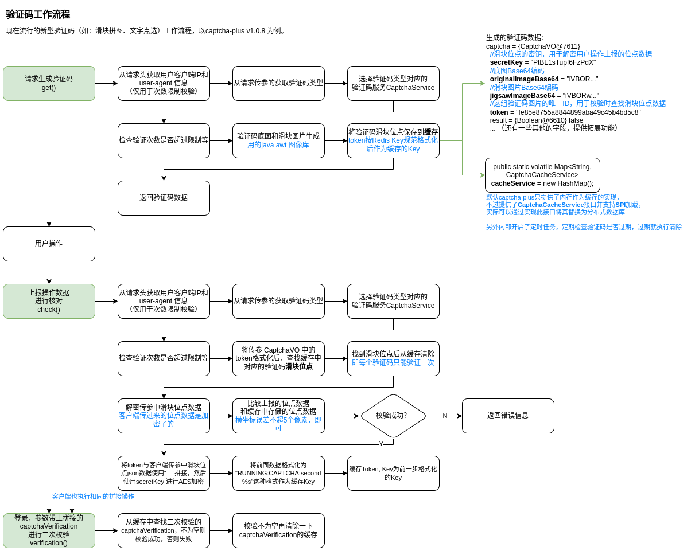

#  验证码

目标：

+ 常见验证码类型及生成
+ 验证码内部校验流程

> **为何现在的用户名密码登录都需要输入验证码？**
>
> 主要是为了接口防刷（防自动化程序操作，即验证用户是否为人类而不是机器），比如防止有人知道用户名后暴力请求接口破解密码，又比如防止有人用自己的帐号恶意帮别人刷票，还有防爬虫等等。
>
> 之前比较普遍的见到的验证码是一个图片里面包含随机生成的数字或字符并包含一些干扰像素，但是现在因为OCR技术和人工智能技术的发展这些验证码也不再安全，现在出现了多种多样的智能验证码，常见的有：[智能无感知验证码](http://dun.163.com/trial/sense)、滑动拼图验证码、图中点选验证码、图标点选验证码、[推理拼图验证码](http://dun.163.com/trial/inference)等，其背后的原理除了对滑块起始位置的认知、图中文字及其顺序的认知外，实际还会基于在页面上的操作行为、操作轨迹，以及当前设备的指纹、所运行的环境等维度进行大数据分析，并利用有监督和无监督的机器学习手段，不断升级和优化模型，不断提供破解的成本，保证人机识别的效果。
>
> 参考：
>
> [网站登录为什么要输入验证码？](https://dun.163.com/news/p/6ccd905a119d436f9655e94457ae4cda)
>
> [QQ登录时为什么需要验证码？](https://kf.qq.com/faq/16122732A7Rv161227zy2ieu.html)

## 开源项目

验证码生成与校验：

+ [xingyuv/captcha-plus](https://github.com/)
+ [tianaiyouqing/tianai-captcha](https://github.com/tianaiyouqing/tianai-captcha)

+ Captcha (经典的文字验证码，这种验证码已被弃用)
  + [penggle/kaptcha](https://github.com/penggle/kaptcha)

验证码破解：

+ [ypwhs/captcha_break](https://github.com/ypwhs/captcha_break)

## 现在常见验证码

+ **拼图验证**

  拖动图块完成拼图。

+ **滑块验证**

  拖动按钮从左边滑到右边。

+ **空间推理**

+ **文字点选**

  按文字顺序点击图片中的文字。

+ **图片识别**

  给出一组图片，选择包含给定元素的所有图片。

+ ......

## 验证码校验流程

以 `captcha-plus` 拼图验证为例，其他原理都差不多：

## 第三方验证码方案

很多第三方的公司也提供了一些验证码方案服务，比如：

+ 阿里云验证码2.0验证流程

  